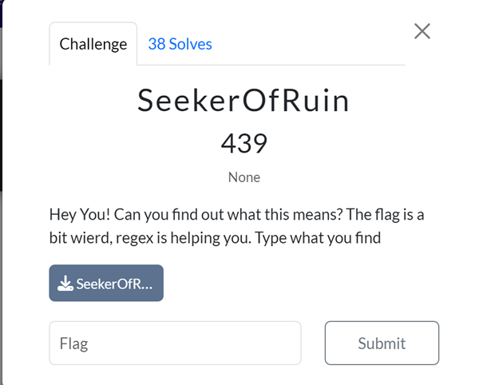
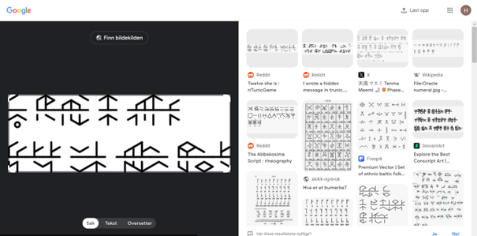
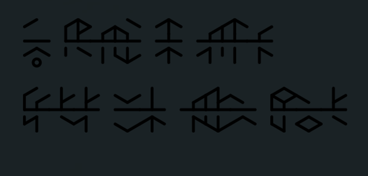
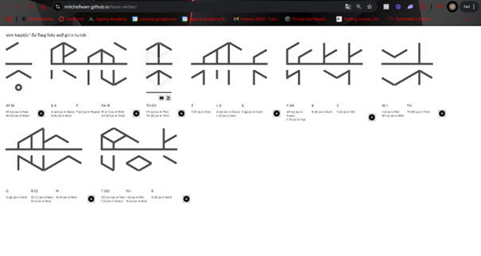

# Challenge: SeekerOfRuin (439 Points)

### Category: Cryptography

### Description
In this challenge, I encountered a sequence of unfamiliar symbols and was tasked with deciphering their meaning. The hint suggested that regex might assist in identifying the flag format. The key was to "write what you find."

### Solution

1. **OSINT Investigation:**
   I used an OSINT tool to analyze the image of the cryptic text. Through this investigation, I discovered that the symbols were from a game called *Tunic*, which uses a unique language system. This finding led me to search for a specific decryption tool for Tunic's in-game language.

   

2. **Decryption Process:**
   After locating a *Tunic* decryption tool, I applied it to the symbols provided in the challenge. This yielded the following message:
   
   > **"I am capture the flag fox with green tunic"**

   
   
   
4. **Interpreting the Flag:**
   After testing different flag formats based on this message, I realized that the challenge prompt's instruction to "write what you find" implied a direct submission. Thus, I formatted the answer accordingly.

5. **Submitting the Flag:**
   Based on the message and following the flag format, I submitted: SiktCTF{FoxWithGreenTunic}
   

### Final Flag
**Flag:** `SiktCTF{FoxWithGreenTunic}`

### Takeaways
This challenge highlighted the importance of utilizing OSINT tools and recognizing symbolic languages in modern media. By identifying that the symbols were from the game *Tunic*, I was able to use a specialized decryption tool to unlock the hidden message. It also reinforced the necessity of carefully reading challenge instructions, as the key to submission was understanding the prompt's instruction to "write what you find." This challenge was a great example of combining cryptography, OSINT, and attention to detail in a CTF setting.

