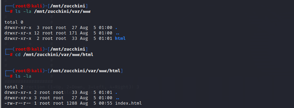

# Challenge: zucchini (409 Points)

### Category: Misc

### Description
In this challenge, I was provided with a file called **zucchini**. The task description hinted at something “plain,” which suggested I needed to investigate this file to find something hidden.

### Solution

1. **Mounting the Zucchini Image**:
   I began by mounting the **zucchini** file as a loop device to explore its contents.

   

2. **Exploring the File System**:
   Navigating through the mounted directory, I discovered a typical Linux file structure. I then went to `/var/www/html` where I found an `index.html` file.

   
   

3. **Analyzing the HTML File**:
   Opening `index.html`, I noticed JavaScript code that included a base64 encoded string and a function to decrypt it using AES-CBC. 

   

4. **Setting Up Decryption in Python**:
   To decrypt the flag, I set up a virtual environment, created a Python script (`squash.py`), and utilized the decryption logic found in `index.html`.

   
   

5. **Flag Extraction**:
   Running the decryption script revealed the flag embedded in the code.

### Flag
`SiktCTF{Summer_Squash_B3Krn5I22dRC215FjiweC}`

### Takeaways
This challenge involved basic forensics techniques, such as mounting a file system and inspecting directory contents. Additionally, understanding cryptographic functions in JavaScript and adapting them to Python was key to successfully decrypting the flag. This task reinforced the value of exploring common web directories and leveraging cryptographic code directly in scripts.
