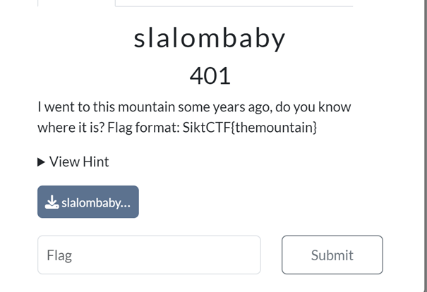
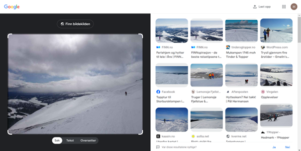
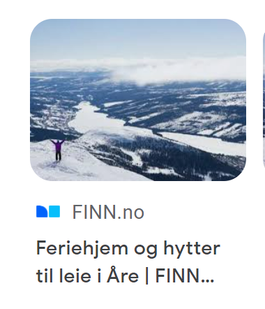
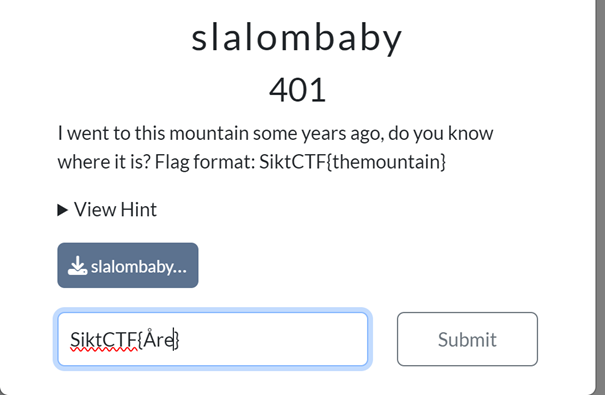

# Challenge: Slalombaby (401)

### Category: OSINT

### Description
This challenge was a classic **OSINT** task that required identifying a specific mountain based on minimal hints and an image.

### Challenge Prompt
- **Points**: 401
- **Description**: "I went to this mountain some years ago, do you know where it is? Flag format: SiktCTF{themountain}"
  
### Solution

1. **Understanding the Task**:
   Based on the description, we needed to identify a mountain from an image and the clue about a previous visit. The flag format was given as `SiktCTF{themountain}`.

2. **Downloading and Analyzing the Image**:
   I downloaded the image labeled `slalombaby`, which showed a snowy mountain landscape with a skier. 

3. **Using Reverse Image Search**:
   Using **Google Reverse Image Search**, I uploaded the image to find any matches that could help identify the location.
   
    

5. **Match Found: Åre, Sweden**:
   The image search returned several matching landscapes, with one clear match indicating Åre, a popular ski resort in Sweden.

   
   
7. **Submitting the Flag**:
   Following the flag format, I entered `SiktCTF{Åre}` and submitted it.

   

9. **Result**:
   The flag was accepted, confirming that Åre was indeed the correct mountain referenced in the challenge!

   

### Takeaways
This task demonstrated the effectiveness of **OSINT techniques** like reverse image search to solve challenges with limited initial information.
