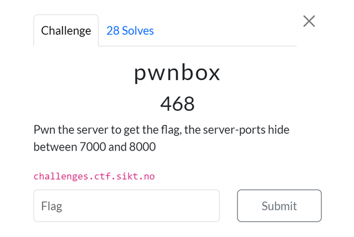
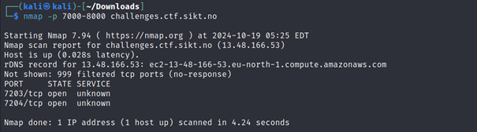
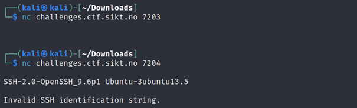
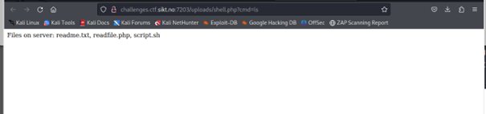
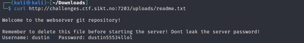
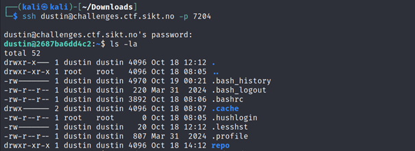
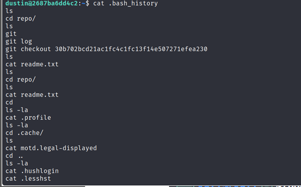
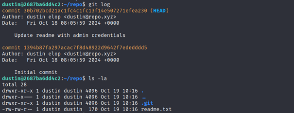
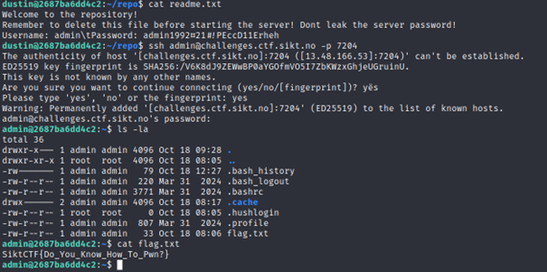

# Challenge: pwnbox (468 Points)

### Category: Pwn

### Description
In this challenge, I needed to "pwn the server to get the flag" by exploring server ports between 7000 and 8000 on `challenges.ctf.sikt.no`.

### Solution

1. **Scanning for Open Ports**:
   I started by scanning the specified port range to identify any open ports. The scan revealed two open ports: 7203 and 7204.

   

2. **Checking Services on Open Ports**:
   I used `nc` to check the services running on these open ports. The response indicated that SSH was active on port 7204, which might require a valid password.

   

3. **Discovering a Web Directory**:
   I navigated to the HTTP server on port 7203 and found a directory listing containing several files: `readme.txt`, `readfile.php`, and `script.sh`.

   

4. **Reading `readme.txt`**:
   The `readme.txt` file contained credentials for the SSH login:
   
   - **Username**: dustin
   - **Password**: dustin55534!lol

   

5. **Logging in via SSH**:
   Using the credentials from `readme.txt`, I successfully logged in to the server over SSH.

   

6. **Exploring the User’s Home Directory**:
   I explored the user's home directory and found several hidden files, including `.bash_history`. Examining this file provided insights into previous commands executed on the server, hinting at the usage of Git commands and a repository directory.

   
   

7. **Investigating the Git Repository**:
   Inside the `repo` directory, I discovered a commit history indicating changes. I used Git to check out previous commits, hoping to uncover sensitive information left behind.

   

8. **Uncovering Admin Credentials**:
   By examining the Git commit log, I found that an earlier commit contained updated credentials for an admin account. Using these credentials, I logged in as the admin user.

   - **Username**: admin
   - **Password**: admin1992P@!!PECDl1eheh

   

9. **Finding the Flag**:
   After logging in as the admin, I found a `flag.txt` file in the directory. Reading this file revealed the flag: SiktCTF{Do_You_Know_How_To_Pwn?}

   

10. **Confirmation**:
 The flag was confirmed to be correct upon submission.

### Takeaways
This challenge demonstrated various techniques, including port scanning, directory traversal, SSH login, exploring bash history, Git commit inspection, and exploiting upload vulnerabilities to gain unauthorized access and retrieve the flag.

