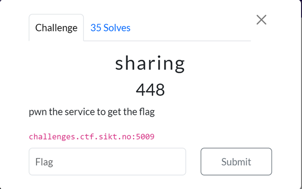
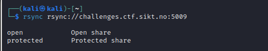
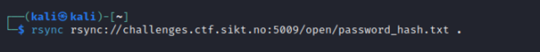
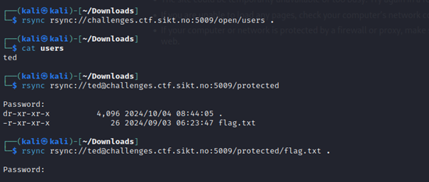
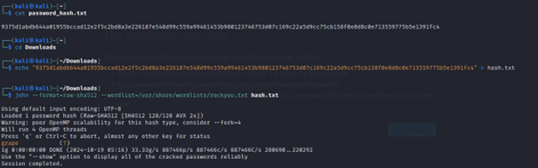
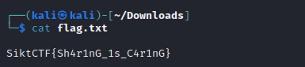

# Challenge: Sharing (448 Points)

### Category: Pwn

### Description
In this challenge, I needed to "pwn the service to get the flag" by exploring an `rsync` file-sharing service located at `challenges.ctf.sikt.no:5009`. The goal was to access and retrieve the flag file from the service.

### Solution

1. **Exploring the rsync Service**:
   I started by listing the available directories in the `rsync` service. I found two directories: `open` and `protected`.

   

2. **Listing Contents in the "open" Directory**:
   Within the `open` directory, there were two files: `password_hash.txt` and `users`. I downloaded these files to analyze further.

   

3. **Analyzing the Files**:
   - The `users` file contained a single username, `ted`.
   - The `password_hash.txt` file contained a hash, which seemed to be a SHA-512 hash.

   
   

4. **Cracking the Hash**:
   Using a tool with a popular wordlist, I cracked the hash and discovered the password for the user `ted`.

   

5. **Accessing the Protected Directory**:
   With the username `ted` and the cracked password, I accessed the `protected` directory. Inside, I found the `flag.txt` file.

   

6. **Retrieving the Flag**:
   I downloaded `flag.txt` and viewed its contents. Inside was the flag: SiktCTF{Sh4r1nG_1s_C4r1nG}
   

7. **Confirmation**:
The flag was confirmed to be correct upon submission.

### Takeaways
This challenge demonstrated how to use the `rsync` service to explore directories, download files, crack a hash, and retrieve sensitive information. By piecing together information from the `open` and `protected` directories, I successfully extracted the flag.

