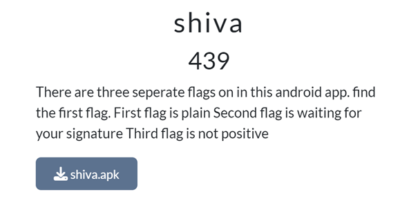
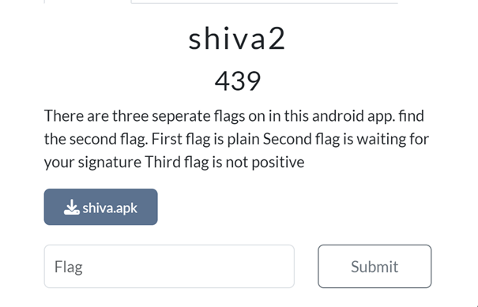
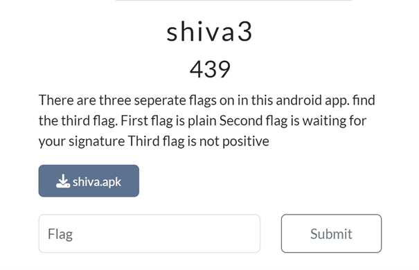
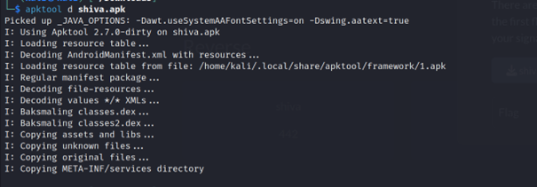
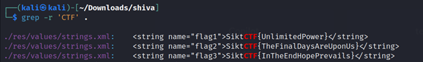

# Challenges: Shiva, Shiva2, Shiva3 (439 Points Each)

### Category: Reverse Engineering

### Description
These challenges required finding three separate flags within an Android application (`shiva.apk`). Each challenge had hints indicating the nature of each flag:
- **Shiva**: Find the first flag.
- **Shiva2**: Find the second flag, which is "waiting for your signature."
- **Shiva3**: Find the third flag, which is "not positive."

### Solution

1. **Decompiling the APK**:
   I used **Apktool** to decompile the `shiva.apk` file, accessing its resources and code structure.

   

   This command extracted the contents of the APK file, revealing various folders and files, including `AndroidManifest.xml`, `res`, and `smali`.

2. **Searching for Flags**:
   After decompiling, I used **grep** to search for any instances of `CTF` within the extracted files, as the flags were expected to follow the `SiktCTF{}` format.

   

   The search led me to the `strings.xml` file in the `res/values` folder, where I found the following entries:

   - `SiktCTF{UnlimitedPower}`
   - `SiktCTF{TheFinalDaysAreUponUs}`
   - `SiktCTF{InTheEndHopePrevails}`

3. **Identifying and Submitting the Flags**:
   Based on the hints provided in each challenge, I determined that each flag corresponds to one of the statements found:
   
   - **Shiva (First Flag)**: `SiktCTF{UnlimitedPower}`
   - **Shiva2 (Second Flag)**: `SiktCTF{TheFinalDaysAreUponUs}`
   - **Shiva3 (Third Flag)**: `SiktCTF{InTheEndHopePrevails}`
   
   
I submitted each of these flags for the respective challenges, and they were all accepted.

### Summary of Flags
- **Shiva**: `SiktCTF{UnlimitedPower}`
- **Shiva2**: `SiktCTF{TheFinalDaysAreUponUs}`
- **Shiva3**: `SiktCTF{InTheEndHopePrevails}`

### Takeaways
This set of challenges emphasized the use of **reverse engineering** and **string search** techniques within decompiled Android applications. By analyzing the resources and metadata, I was able to extract each flag effectively and solve all three challenges at once.

