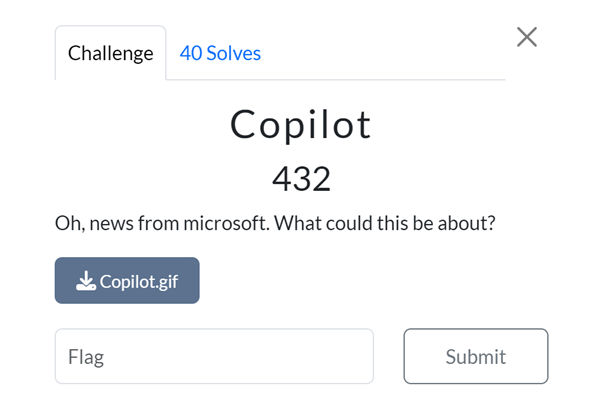
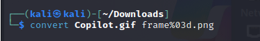
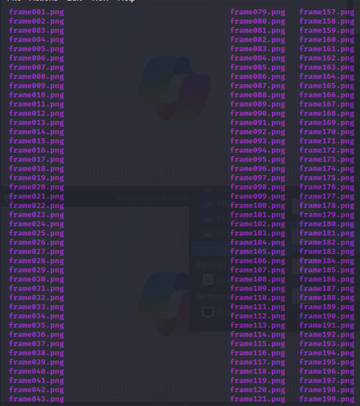
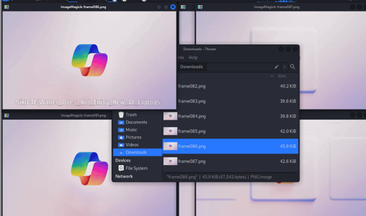

# Challenge: Copilot (432 Points)

### Category: Stegonography

### Description
In this challenge, a GIF file named `Copilot.gif` was provided with the hint: "Oh, news from Microsoft. What could this be about?" This suggested that the solution might involve analyzing the GIF file for hidden information related to Microsoft’s Copilot.
 
### Solution

1. **Extracting Frames from the GIF**:
   To analyze each frame individually, I used **ImageMagick** to convert the GIF into separate PNG frames.

   

   This command extracted hundreds of frames, labeled sequentially as `frame001.png`, `frame002.png`, and so on.

   

2. **Inspecting the Frames**:
   I browsed through the extracted frames and noticed that some frames contained text overlays. Upon closer inspection, I found that **frame086.png** had a message with the following text: SiktCTF{Walter_Does_Not_Enjoy_New_AI_Laptops}

3. **Confirming the Flag**:
After identifying the text in frame 086, I used it as the flag and submitted:

4. **Result**:
The flag was accepted, and the challenge was completed.

### Takeaways
This challenge demonstrated the importance of extracting and inspecting individual frames in GIF files, as they can sometimes contain hidden messages across multiple frames. Tools like **ImageMagick** make it easy to convert animated files into frame sequences for detailed analysis.

