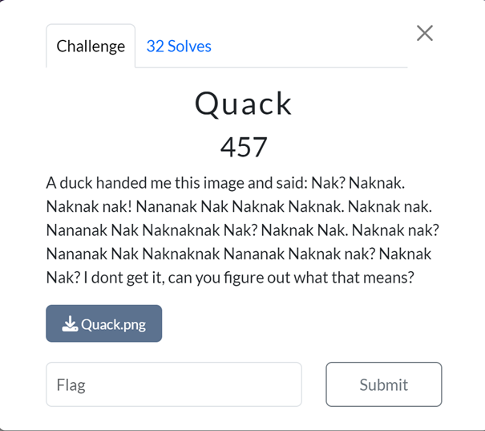

### Challenge: Quack (457 Points)

#### Category: Stegonography

#### Description
In this challenge, I encountered a cryptic message that appeared as repeated "Nak Nak" phrases, with the prompt suggesting that a duck handed it over. This unusual text hinted at a cipher or code.

#### Solution

1. **Initial Decryption with DuckSpeak**:
    - Based on the task description, I suspected that the repeated "Nak Nak" phrases were encoded in a cipher known as "DuckSpeak."
    - I used an online DuckSpeak decryption tool and entered the message. This initial decryption returned the sentence: "I'm in the red," which indicated a clue to explore further.

    

2. **Analyzing the Image's Red Channel**:
    - Following the clue, "I'm in the red," I decided to examine the red channel of the image `Quack.png` for hidden information.
    - Using an extraction tool, I uncovered Base64-encoded text embedded within the red channel of the image.

    

3. **Decoding Base64**:
    - After obtaining the encoded text, I decoded it from Base64 format, which transformed the content into a sequence of "Nak Nak" phrases.

    

4. **Decrypting the Nak Nak Message**:
    - I then used the DuckSpeak tool again to decode the "Nak Nak" phrases from the Base64-decoded text, which translated into readable ASCII text.

    

5. **Flag Retrieval**:
    - The final decoded text revealed the flag: `SiktCTF{Im_MuLt1l1nGu4l_MY_MOTH3R_T0UNG3_IS_DUCKSP34K}`

    

#### Takeaways
This challenge underscored the importance of following clues carefully, as the initial decryption led me to inspect specific parts of the image. It reinforced the utility of unconventional ciphers and creative use of image channels in CTF challenges, highlighting the diverse methods used to conceal information.
