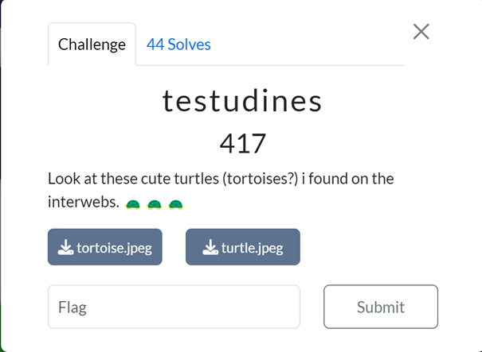
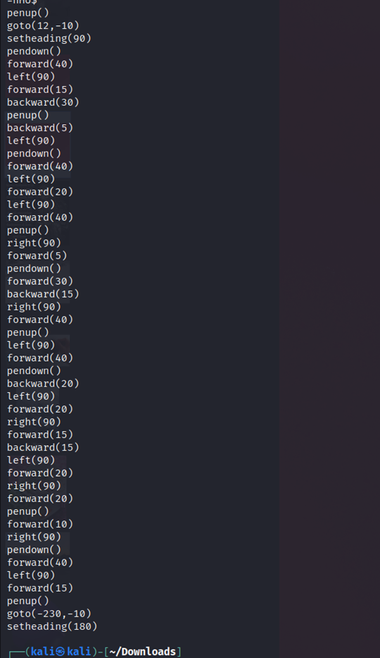
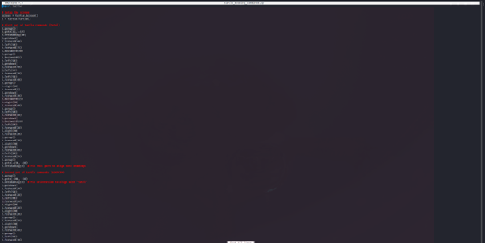
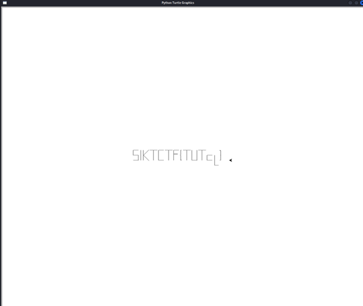

# Challenge: Testudines (417 Points)

### Category: Stegonography

### Description
This challenge provided two image files, `tortoise.jpeg` and `turtle.jpeg`, along with the hint: "Look at these cute turtles (tortoises?) I found on the interwebs." The challenge hinted at using turtle graphics to reveal a hidden message.

### Solution

1. **Extracting Turtle Graphics Code**:
   First, I used the `strings` command to analyze the contents of the provided files. This command extracted readable text from the images, which turned out to be turtle graphics instructions in Python.

   

2. **Creating a Python File**:
   I copied the extracted turtle graphics commands and saved them into a Python file. This allowed me to run the code using Python’s turtle graphics module, expecting it to reveal hidden content.

   

3. **Running the Turtle Graphics Code**:
   Once the code was prepared, I executed it in Python. The turtle graphics instructions drew out a pattern on the screen, eventually displaying a hidden flag.

   

4. **Output and Flag**:
   After the turtle graphics code finished running, it displayed the following output: SIKTCTF{Tutel}

   

5. **Confirmation**:
The flag was confirmed as valid after submission.

### Takeaways
This challenge demonstrated how graphical representations using turtle commands can encode messages. By using the `strings` command to extract the turtle instructions and running them in a Python file, I was able to reveal the flag embedded in the visual output.

